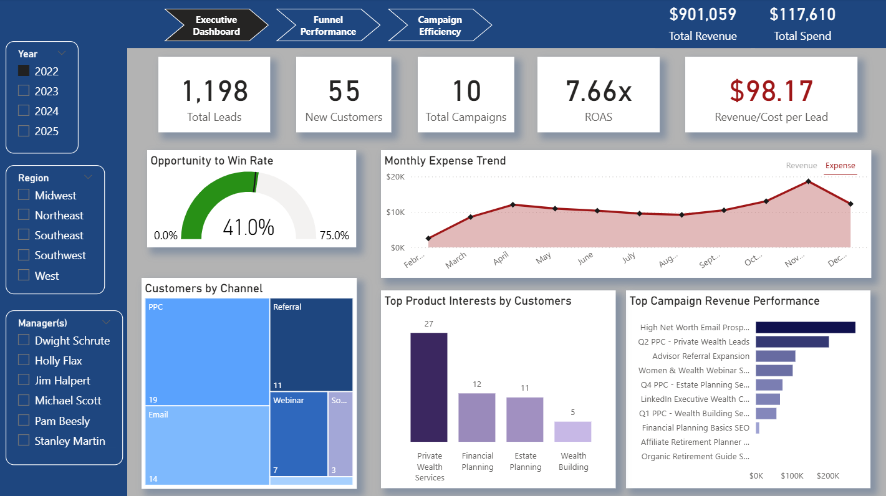
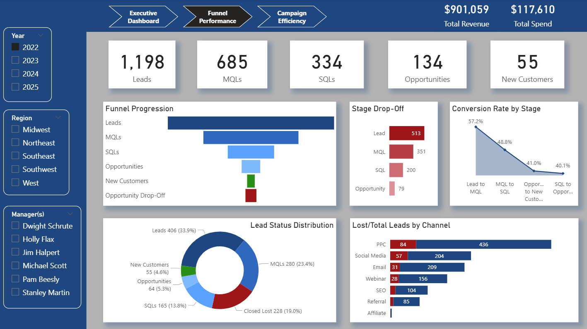

# Marketing Analytics Dashboard (Power BI)

This Power BI project analyzes campaign performance, lead funnel progression, and marketing-to-sales outcomes for a sample wealth management company. The dashboard was built to evaluate which channels and campaigns drive the most qualified leads and customers, where the biggest funnel drop-offs occur, which campaigns are most efficient, and how marketing contributes to pipeline and revenue. The project uses a custom sample dataset modeled in a star schema with two fact tables and supporting dimensions.

## Project Summary
Built a 3-page Power BI marketing analytics dashboard for a sample wealth management company to evaluate campaign performance, lead funnel conversion, marketing efficiency, and revenue impact. Designed a star schema with two fact tables and supporting dimensions, then created DAX measures and interactive visuals to answer five core business questions for leadership decision-making.

## Business Questions
This dashboard was built to answer the following questions:

1. Which channels and campaigns drive the most leads, qualified leads, and conversions?
2. Where are the biggest funnel drop-offs happening from Lead to MQL to SQL to Opportunity to Closed Deal?
3. Which campaigns are the most efficient based on cost per lead, cost per qualified lead, cost per opportunity, and cost per customer?
4. How much pipeline and revenue is marketing influencing or generating by channel, campaign, and time period?
5. How is performance changing over time, and where should budget be increased, reduced, or reallocated?

## Tools Used
- Power BI Desktop
- DAX
- CSV source files
- Star schema data modeling
- GitHub for project documentation and presentation

## Data Model
The project uses a star schema centered around two fact tables:

- **Fact_Lead_Funnel**: one row per lead, including current stage, previous stage, stage progression flags, pipeline amount, and revenue amount
- **Fact_Campaign_Performance**: aggregated campaign performance metrics by date, campaign, channel, source, region, and product interest

Supporting dimensions:
- Dim_Date
- Dim_Campaign
- Dim_Channel
- Dim_Source
- Dim_Region
- Dim_Lead_Status
- Dim_Audience

This structure supports campaign analysis, funnel progression analysis, and revenue/pipeline reporting while keeping the model clean and scalable.

## Dashboard Pages

### Page 1 - Executive Overview
Provides a high-level view of marketing performance with KPI cards for revenue, spend, leads, customers, campaigns, ROAS, and revenue per lead. This page also includes campaign, channel, and product-interest views, along with a monthly trend to support executive decision-making.

### Page 2 - Funnel Analysis
Focuses on lead progression through the funnel using stage KPIs, funnel visuals, drop-off analysis, lead status distribution, and lost-lead channel analysis. This page is designed to identify where leads stall or exit the funnel.

### Page 3 - Campaign Efficiency and Revenue Impact
Highlights campaign efficiency and downstream business value using pipeline, CPL, cost per opportunity, cost per customer, ROAS, channel-level revenue/spend analysis, top campaigns by pipeline, and source engagement.

## What This Project Demonstrates
- Building a Power BI dashboard from a custom sample dataset
- Designing a star schema with multiple fact tables
- Creating DAX measures for campaign, funnel, and revenue analysis
- Using business-focused KPI design instead of chart-first reporting
- Structuring a dashboard around specific stakeholder questions
- Building interactivity through slicers, field parameters, tooltips, and cross-filtering
- Presenting performance, efficiency, and funnel outcomes in an executive-friendly format

## What I Discovered from the Analysis
- High lead volume does not always translate into strong customer conversion, which makes funnel progression as important as top-of-funnel acquisition.
- Some channels generate efficient customer outcomes even without leading in raw lead volume, showing the importance of comparing volume with efficiency.
- Pipeline contribution and revenue contribution are not always driven by the same campaigns, which highlights the need to evaluate both short-term and downstream value.
- Funnel drop-off analysis is critical because weak stage-to-stage conversion can reduce the impact of otherwise successful acquisition efforts.
- Revenue and spend trends become more useful when paired with conversion and efficiency measures, since performance changes over time are not always visible in volume metrics alone.

## Repository Contents
- Power BI dashboard file (.pbix)
- Source CSV files used for the project
- Screenshot exports of each dashboard page
- Documentation describing the model and business purpose of the dashboard
- Core DAX measures used throughout the report

## Screenshots

### Executive Overview

### Funnel Analysis

### Campaign Efficiency and Revenue Impact

## Core Measures
- Total Revenue
- Total Spend
- Total Leads
- Total Customers
- Total Campaigns
- Revenue per Lead
- ROAS
- Total Pipeline
- CPL
- Cost per Opportunity
- Cost per Customer
- Reached Lead
- Reached MQL
- Reached SQL
- Reached Opportunity
- Reached Closed Won
- Lead to MQL Rate (Funnel)
- MQL to SQL Rate (Funnel)
- SQL to Opportunity Rate (Funnel)
- Opportunity to Won Rate (Funnel)
- Lead Drop-Off
- MQL Drop-Off
- SQL Drop-Off
- Opportunity Drop-Off

## Why This Project Matters
This project shows how marketing analytics can move beyond surface-level reporting and support real budget and funnel decisions. Instead of focusing only on traffic or lead volume, the dashboard connects acquisition, qualification, conversion, pipeline, and revenue so decision-makers can evaluate both efficiency and business impact.
